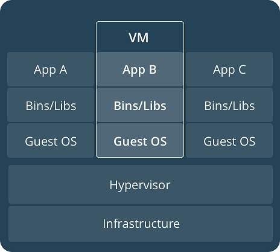
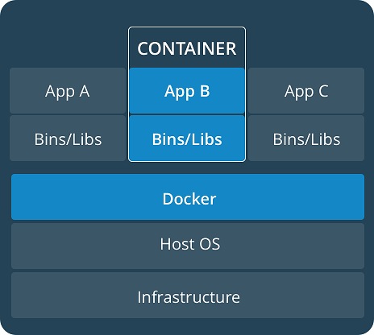
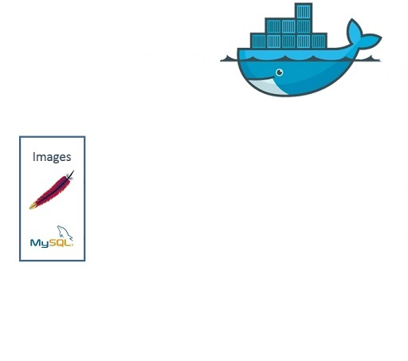
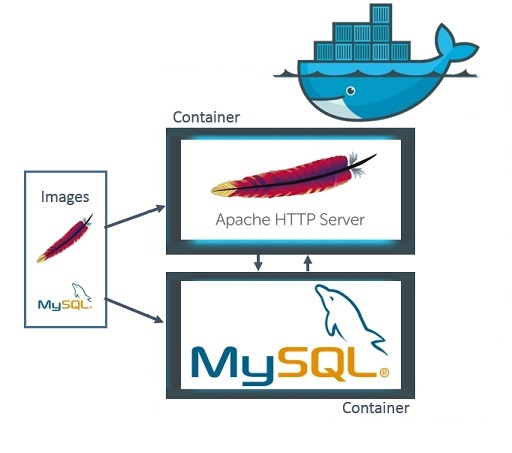
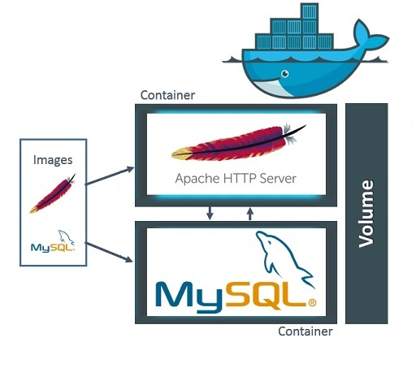
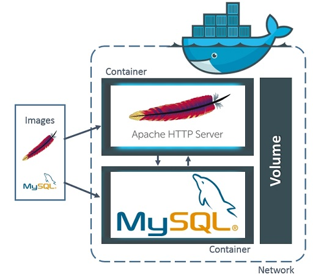
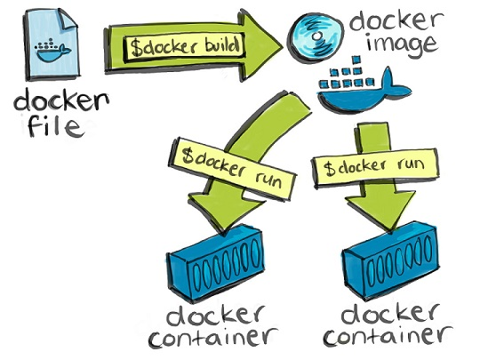

title: Docker
class: animation-fade
layout: true

<!-- This slide will serve as the base layout for all your slides -->
.bottom-bar[
  {{title}}
]

---

class: impact

# {{title}}
## Introduction to docker

---

# What is Docker?

--

Docker is a tool designed to make it easier to **create**, **deploy**, and **run** *applications* by using **containers**

--

Containers allow **packing up** an application and ship it out as one **artifact**

--

Developer can *rest* assured that the application will run on any other *environment*

--

Docker is *"like"* a virtual machine. But sharing the same Linux kernel as host

--

**+** performance boost, **-** application size

--

Docker is open source. [https://github.com/docker/docker-ce](https://github.com/docker/docker-ce)

---

# Who is Docker for?

Developers and system administrators (DevOps)

--

Developers can focus on writing code without worrying about the system

--

Docker allows developers to use thousands of applications already build to run in a Docker container

---

# Virtual Machine vs Docker

--

.col-6[

]

--

.col-6[

]

---

# Docker Terminology

--

## Image

It is a "**cooking recipe**"

Definitions how to boot the environment, monotask

--

## Container

**Instantiations of images**

Like in POO; Image -> Class, Container -> Object. Not persistent.

Comunication tcp/ip

---

# Docker Terminology

--

## Volumes

**Underlying data layer**.

Can be used across containers.

Persistent in host

--

## Networks

Docker comes with its own networking capabilities

The name of a container is its hostname

---

# Docker structure

.center[

]

---

# Docker structure

.center[

]

---

# Docker structure

.center[

]

---

# Docker structure

.center[

]

---

# Getting started

--

.col-6[

]

--

.col-6[
`Dockerfile` example 1
.small[
```docker
FROM node:8
RUN apt-get update && apt-get -y upgrade
COPY src /app/src
COPY package.json /app/
RUN npm install
CMD ["npm", "start"]
```
]

`Dockerfile` example 2
.small[
````docker
FROM java:9-jdk
EXPOSE 8080
COPY target/*.jar /application/app.jar
CMD java -jar /application/app.jar
````
]
]

---

# Dockerfile multi-stage builds

## Before multi-stage

--

.col-6[
`Dockerfile.build`:

```docker
FROM node:8
WORKDIR /app
COPY src .
RUN npm install \
  && npm run build
```
]

.col-1[&nbsp;]

.col-5[
`Dockerfile`:

```docker
FROM nginx:latest
COPY www /var/www/html
EXPOSE 80
```
]

---

# Dockerfile multi-stage builds

## Before multi-stage

`build.sh`:

```bash
#!/bin/sh
echo "Building application:build"
docker build -t application:build . -f Dockerfile.build
docker container create --name extract application:build
docker container cp extract:/app/build/www ./www
docker container rm -f extract
echo "Building application:latest"
docker build --no-cache -t application:latest .
rm -fr ./app
```

---

# Dockerfile multi-stage builds

## With multi-stage

`Dockerfile`:

```docker
FROM node:8 as builder
WORKDIR /app
COPY src .
RUN npm install \
  && npm run build
  
FROM nginx:latest
COPY --from=builder /app/build/www /var/www/html
EXPOSE 80
```

---

# Dockerfile basic commands

`FROM`: Base image to use

`RUN`: Execute instruction in layer

`EXPOSE`: Port/protocol to listen in container (documentation)

`ENV`: Define environment variables

`COPY`: Copy files when image is created

`CMD`: Command as default in container start

`WORKDIR`, `USER`, `ENTRYPOINT`, `ADD`, `LABEL`, `VOLUME`, ...

---

# Docker basic commands

```bash
$ docker --help
```

`build`: Build an image using Dockerfile

`run`: Create a container by running image on it

`image`: Manage images in host

`ps`: List containers

`container`: Manage containers

`exec`: Execute command in a running container

`network`, `cp`, `start`, `stop`, `info`, `logs`, `push`, `pull`, ...

---

# Docker basic usage

```bash
$ docker build -t <image name> <path/to/Dockerfile/>
```

```bash
$ docker run -d -p 8080:80 nginx
  777aff8f80f50786a48299b243506a1bd4db175d1a62c372f7c8c54c7a8412ad
```

````bash
$ docker ps
  CONTAINER ID   IMAGE    COMMAND                  CREATED          STATUS         PORTS                  NAMES
  777aff8f80f5   nginx    "nginx -g 'daemon ..."   27 seconds ago   Up 8 seconds   0.0.0.0:8088->80/tcp   fervent_bose
````

```bash
$ docker images
REPOSITORY   TAG      IMAGE ID      CREATED       SIZE
nginx        latest   e548f1a579cf  3 months ago  109MB
```

---

# Docker basic usage

```bash
$ docker run hello-world
Unable to find image 'hello-world:latest' locally
latest: Pulling from library/hello-world
9bb5a5d4561a: Pull complete
Digest: sha256:f5233545e43561214ca4891fd1157e1c3c563316ed8e237750d59bde73361e77
Status: Downloaded newer image for hello-world:latest

Hello from Docker!
This message shows that your installation appears to be working correctly
...
```

---

# Docker basic usage

```bash
$ docker run --rm -it ubuntu:17.04 bash
Unable to find image 'ubuntu:17.04' locally
17.04: Pulling from library/ubuntu
c2ca09a1934b: Pull complete
d6c3619d2153: Pull complete
0efe07335a04: Pull complete
6b1bb01b3a3b: Pull complete
43a98c187399: Pull complete
Digest: sha256:5d41c289942008211c2964bca72800f5c9d5ea5aa4057528da617fb36463d4ab
Status: Downloaded newer image for ubuntu:17.04
root@5812c9945247:/# ls
bin  boot  dev  etc  home  lib  lib64  media  mnt  opt  proc  root  run  sbin  srv  sys  tmp  usr  var
root@5812c9945247:/#
```

---

# Docker Hub

Register at [https://hub.docker.com/](https://hub.docker.com/) and you could upload images

````bash
$ docker login
  Login with your Docker ID to push and pull images from Docker Hub. If you don't have a Docker ID, head over to https://hub.docker.com to create one.
  Username: username
  Password: ********
  Login Succeeded
$ docker build -t username/repository:tag
$ docker tag image username/repository:tag
$ docker push username/repository:tag
$ docker run username/repository:tag
````

---

# Docker compose

Tool for defining and running multi-container Docker apps

User `YAML` file to configure your application's services

Start, stop, rebuild, view status, logs of all services or selected only

[https://github.com/docker/compose/releases/download/1.21.2/docker-compose-Windows-x86_64.exe](https://github.com/docker/compose/releases/download/1.21.2/docker-compose-Windows-x86_64.exe)

---

# Docker compose

`docker-compose.yml` example

```yaml
version: '3'
services:
  web:
    build: .
    ports:
      - "5000:5000"
    volumes:
      - .:/code
      - logvolume01:/var/log:ro
    links:
      - database
  database:
    image: mysql
volumes:
  logvolume01: {}
```

---

.center[
# End
]

## Useful links

- [https://docs.docker.com/get-started/](https://docs.docker.com/get-started/)

- [https://hub.docker.com/](https://hub.docker.com/)

- [https://docs.docker.com/compose/overview/](https://docs.docker.com/compose/overview/)

- [https://docs.docker.com/machine/overview/](https://docs.docker.com/machine/overview/)

- [https://docs.docker.com/samples/](https://docs.docker.com/samples/)
